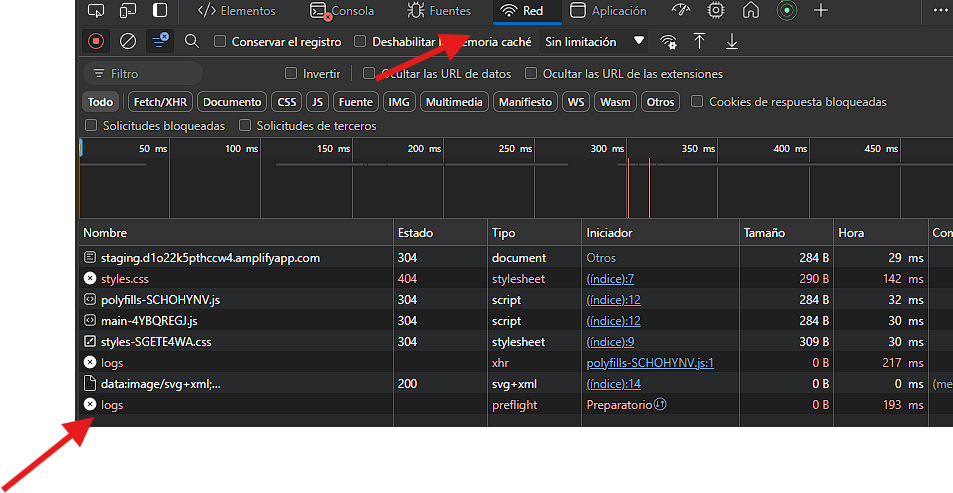
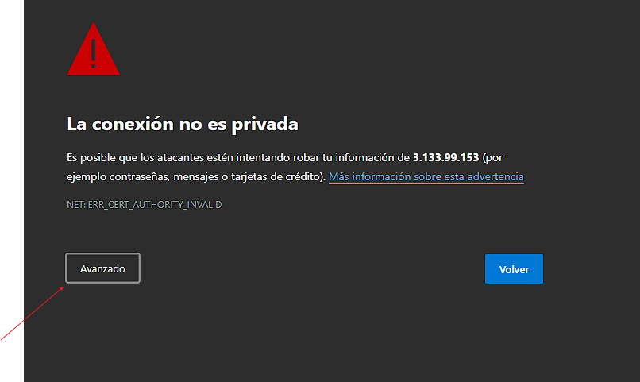
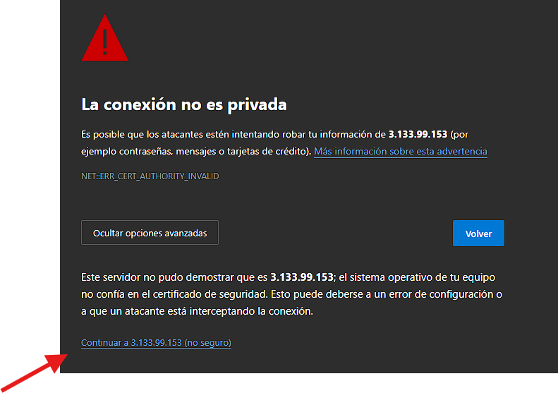

# Guía de Uso del Aplicativo Web

## Acceso al Aplicativo

1. Abre el navegador y visita la siguiente URL: [https://staging.d1o22k5pthccw4.amplifyapp.com/](https://staging.d1o22k5pthccw4.amplifyapp.com/)
2. Presiona `F12` para abrir las herramientas de desarrollo del navegador.
3. Navega a la pestaña **Red** o **Network**.
4. Actualiza la página (presiona `F5`).
5. Si ves una petición en rojo con el nombre **logs**, haz doble clic en ella y acepta el certificado autofirmado.




## Agregar y Filtrar Eventos

1. En la interfaz visual, puedes agregar eventos manualmente.
2. Los eventos de la tabla pueden ser filtrados según el tipo y la fecha del evento.

## Inserción de Eventos Múltiples

Para insertar eventos múltiples a través de la API, utiliza el siguiente endpoint:

- **URL**: [https://3.133.99.153:3000/api/logs](https://3.133.99.153:3000/api/logs)
- **Método**: `POST`

### Encabezados

Envía el siguiente encabezado con tu solicitud:

- **x-api-key**: `hbytgxjtwdbucrqjvqoyxbopqjupuykj`

### Cuerpo de la Solicitud

El cuerpo de la solicitud debe ser un array JSON con la siguiente estructura:

```json
[
    {
        "event_date": "2024-09-11T15:30:00Z",
        "description": "Error en el servidor",
        "event_type": "API"
    },
    {
        "event_date": "2024-09-12T10:15:00Z",
        "description": "Inicio de sesión exitoso",
        "event_type": "API"
    }
]
```

Ajusta el número de objetos en el array según la cantidad de eventos que deseas insertar.


## Tecnologías Utilizadas

Backend: Node.js, RabbitMQ
Frontend: Angular

